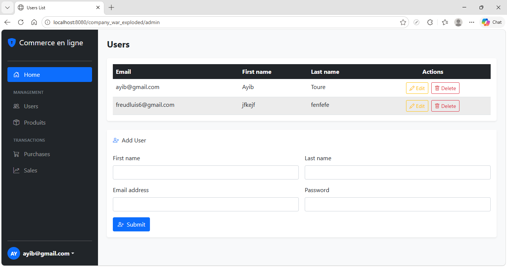
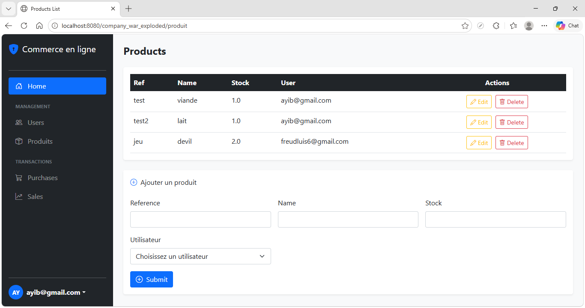
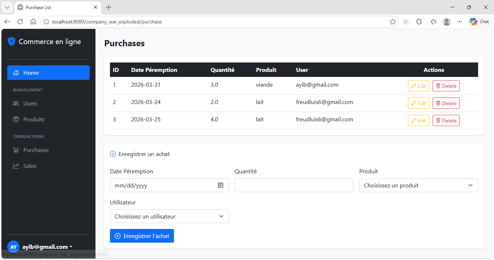
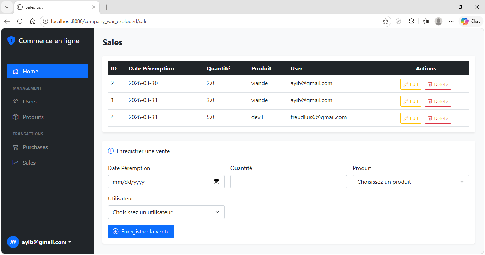

## Technologies

### Backend
- **Java 21** - Langage de programmation principal
- **Maven** - Gestionnaire de build et dépendances
- **Jakarta Servlet 6.1** - API servlets modernes
- **Hibernate 6.6** - ORM (Object-Relational Mapping)
- **JPA (Jakarta Persistence)** - Spécification de persistance
- **CDI (Contexts and Dependency Injection)** - Injection de dépendances

### Frontend
- **JSP (JavaServer Pages)** - Templates côté serveur
- **JSTL (Jakarta Standard Tag Library)** - Librairie de tags
- **CSS** - Mise en page et styling

### Base de Données
- **PostgreSQL 15** - Gestionnaire de base de données relationnel
- **Flyway 9.7** - Versioning et migration de schéma DB

### Outils et Librairies
- **Lombok 1.18** - Réduction du boilerplate Java
- **Logback 1.5** - Framework de logging
- **dotenv-java** - Gestion des variables d'environnement

### Déploiement
- **Docker & Docker Compose** - Containerisation
- **Tomcat** - Serveur d'application (à déployer)

## Prérequis

### Obligatoires
- **Java 21 JDK** ou supérieur
- **Maven 3.8+**
- **Docker & Docker Compose** (pour la base de données)

### 1. Démarrer la base de données
```bash
docker-compose up -d
```

Cela lance:
- **PostgreSQL** sur le port 5433
- **pgAdmin** sur le port 81 (pour gérer la DB)

**Identifiants pgAdmin:**
- Email: `admin@admin.com`
- Mot de passe: `admin`

### 2. Compiler le projet
```bash
mvn clean compile
```

### 3. Exécuter les migrations de base de données
```bash
mvn flyway:migrate
```

## Exécution

### Classe Main (Thread Runnable)
La classe `Main` implémente `Runnable` et permet de tester l'insertion d'utilisateurs en base de données :

Cette classe crée un nouvel utilisateur test (Ayib Toure) via le `UserService` et l'enregistre en base de données.

### Avec un serveur Tomcat (Application Web)
1. Installez Tomcat 11.0.8+ (compatible avec Jakarta)
2. Copiez `target/company-1.0-SNAPSHOT.war` dans le dossier `webapps` de Tomcat
3. Démarrez Tomcat


L'application sera accessible sur `http://localhost:8080/company`

## Structure du Projet

```
src/main/
├── java/com/groupeisi/com/company/
│   ├── controllers/        # Contrôleurs web
│   ├── services/           # Logique métier
│   ├── dao/                # Accès aux données
│   ├── entities/           # Classes JPA/Hibernate
│   ├── dto/                # Data Transfer Objects
│   ├── mappers/            # Mappers entités <-> DTOs
│   ├── config/             # Configuration CDI
│   ├── resources/          # Ressources (accès DB)
│   ├── HelloServlet.java   # Servlet exemple
│   └── Main.java           # Point d'entrée
├── resources/
│   ├── flyway.conf         # Configuration Flyway
│   ├── db/migrations/      # Scripts migration SQL
│   └── META-INF/
│       ├── beans.xml       # Configuration CDI
│       └── persistence.xml # Configuration JPA/Hibernate
└── webapp/
    ├── WEB-INF/
    │   ├── web.xml         # Descripteur d'application
    │   └── jsp/            # Templates JSP
    ├── index.jsp
    └── public/             # Assets statiques (CSS, JS)
```
## Interface de l'application
- Gestions des Users

- Gestions des Produits

- Gestions des purchases

- Gestions des sales


## Base de Données

### Connexion
- **Host:** localhost
- **Port:** 5433
- **Base:** companydb
- **Utilisateur:** user
- **Mot de passe:** passer123@

### Migrations
Les migrations SQL sont versionnées dans `src/main/resources/db/migrations/`
- `V1__init_db.sql` - Initialisation du schéma

Exécutées automatiquement lors du déploiement via Flyway.

## Variables d'Environnement (.env)

Le fichier `.env` se trouve dans `src/main/resources/` pour surcharger les paramètres :
```properties
DB_URL=jdbc:postgresql://localhost:5433/companydb
DB_USER=user
DB_PASSWORD=passer123@
LOG_LEVEL=INFO
```

Un fichier `.env.example` est également fourni comme modèle.

## Dépannage

**Port 5433 déjà utilisé?**
```bash
# Modifier le port dans docker-compose.yml
# Puis: docker-compose down && docker-compose up -d
```

**Erreurs de migration Flyway?**
```bash
# Nettoyer et réinitialiser
mvn flyway:clean
mvn flyway:migrate
```
